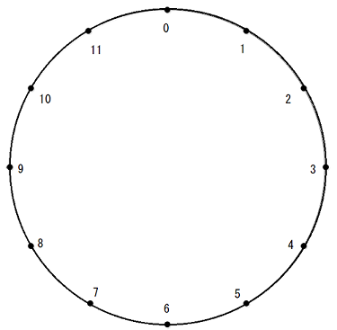
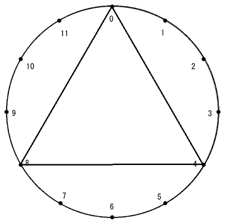
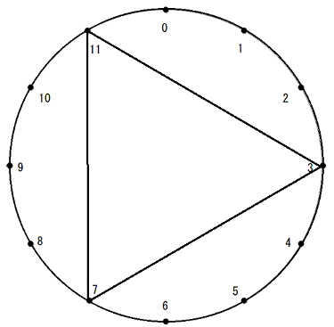
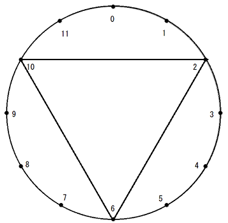

# No.1893 Cycle

## 제한

- 시간 제한: 2초
- 메모리 제한: 512MB

## 문제

아래 그림과 같이 원주상에 등간격으로 12개의 점이 찍혀있습니다. 점에는 시계방향으로 $0, 1, 2, \cdots, 11$이란 번호가 붙어있습니다.



Shirotsume는 이 점 중에서 $3$개의 서로 다른 점 $X, Y, Z$를 골라서 각각을 선분으로 이어 **정삼각형**을 만들었습니다.

$X, Y$가 주어지면 $Z$를 구해 주세요.

## 제한 

- 모든 입력은 정수다.
- $0 \le X \le 11$
- $0 \le Y \le 11$
- $X \ne Y$
- 점 $X, Y, Z$ 각각을 선분으로 이었을 때 만들어지는 삼각형이 정삼각형이 되는 $Z$가 존재하는 입력만 주어진다.

## 입력

입력은 표준 입력에서 다음과 같은 형식으로 주어집니다.

|$X$  $Y$|
|:-|

## 출력

정답이 되는 정수 $Z (0 \le Z \le 11)$을 출력해주세요. 마지막에 개행문자를 출력해주세요.

## 예제

### 예제 1

입력

```
0 4
```

출력

```
8
```

$(X, Y, Z) = (0, 4, 8)$이라고 하면, 다음 그림과 같은 삼각형이 만들어집니다.




### 예제 2

입력

```
11 7
```

출력

```
3
```

$(X, Y, Z) = (11, 7, 3)$이라고 하면, 다음 그림과 같은 삼각형이 만들어집니다.



### 예제 3

입력

```
6 10
```

출력

```
2
```

$(X, Y, Z) = (6, 10, 2)$라고 하면, 다음 그림과 같은 삼각형이 만들어집니다.


