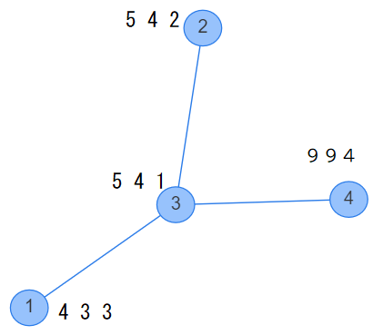
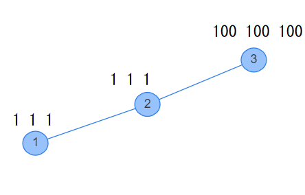
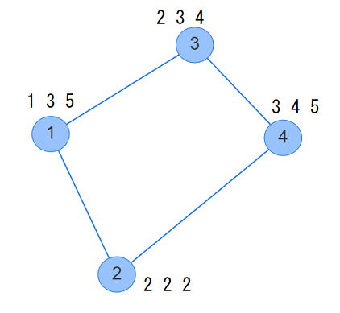

# No.1898 Battle and Exchange

## 제한

- 시간 제한: 5초
- 메모리 제한: 512MB
-  스페셜 저지 문제 (답이 여러 개 존재할 수 있습니다)

## 문제

$N$개의 정점 $M$개의 간선으로 되어있는 단순 무향그래프가 있습니다. $i$번 $(1 \le i \le M)$ 간선은 $U_i$번 정점과 $V_i$번 정점을 잇습니다. 이 그래프에서 시련이 주어집니다.

각 정점에는, 한 명씩 사람이 서 있습니다. 각각의 사람은 양의 정수가 적힌 카드를 $3$장 가지고 있습니다. $i$번 $(1 \le i \le N)$ 정점에 있는 사람이 가진 카드에 적힌 정수는 $A_i, B_i, C_i$입니다.

위에서 언급한 $N$명 이외에도 도전자인 당신은 $1$번 정점에 있습니다. 당신은 다른 사람과 마찬가지로 양의 정수가 적힌 카드를 $3$장 가지고 있습니다. 시련은 다음과 같은 방식으로 진행됩니다.

- 지금 당신이 있는 정점에 서 있는 사람(이하, 상대)이 가지고 있는 카드에 써 있는 정수를 $A_x, B_x, C_x$, 당신이 가지고 있는 카드에 써 있는 정수를 $A', B', C'$이라고 합니다. $A' + B' + C' > A_x + B_x + C_x$이면 당신의 승리이고, 그렇지 않으면 당신의 패배입니다.
- 당신이 패배하면 시련은 실패로 죵로됩니다. 당신이 승리하면 상대의 카드와 자신의 카드를 각각 한 장씩 골라서 교환할 수 있습니다. 교환하지 않아도 됩니다. 그 후, 당신은 정점에 인접한 원하는 정점으로 이동할 수 있습니다. 이 과정에서 같은 정점을 여러번 방문해도 됩니다.
- 이동한 정점에서 위 작업을 반복합니다. $N$번 정점에 있는 사람을 이기면 시련에 성공합니다.

시련 과정에서 당신 이외의 사람은 이동하지 않습니다.

당신이 처음 가지고 있는 카드에 적힌 양의 정수를 각각 $A, B, C$라고 합시다. 시련이 성공하기 위한 $A, B, C$ 중에 $A+B+C$가 최소가 되는 것을 하나 구해주세요.

## 제한

- 모든 입력은 정수다.
- $2 \le N \le 10^5$
- $N-1 \le M \le \min\left(\frac{N(N-1)}{2}, 10^5\right)$
- $1 \le U_i, V_i \le N$ $(1 \le i \le M)$
- 주어진 그래프는 연결이고 단순그래프이다. (다중간선이나 루프가 없다.)
- $1 \le A_i, B_i, C_i \le 10^8$ $(1 \le i \le N)$

## 입력

입력은 표준 입력에서 다음 형식으로 주어집니다.

| $N$  $M$<br />$U_1$  $V_1$<br />$U_2$  $V_2$<br />$\vdots$<br />$U_M$  $V_M$<br />$A_1$  $B_1$  $C_1$<br />$A_2$  $B_2$  $C_2$<br />$\vdots$<br/>$A_N$  $B_N$  $C_N$<br />|
| :----------------------------------------------------------- |

## 출력

시련에 성공하는 $A, B, C$가 존재해서, $A+B+C$가 최소가 되는 것을 아래의 형식으로 출력해주세요. 정답인 $A, B, C$가 여럿인 경우, 어느것을 출력해도 정답입니다.
|$A$  $B$  $C$|
| :- |

마지막에 개행문자를 출력해주세요.

## 예제

### 예제 1

입력

```
4 3
4 3
3 2
1 3
4 3 3
5 4 2
5 4 1
9 9 4

```

출력

```
1 13 1
```

그래프의 각 정점에 있는 사람이 처음에 가지고 있는 카드는 아래 그림과 같습니다.



$A=1, B=13,C=1$이라고 했을 때 예시입니다. 아래에서 정수 $X$가 적힌 카드를 단순히 $X$라고 합니다.

처음에, $1$번 정점에 있습니다. $1$번 정점에 있는 사람의 카드는 $4, 3, 3$이고, $4+3+3 < 1+13+1$이므로 당신의 승리입니다.

이긴 이후, 당신이 가지고 있는 $1$중 한 장(이번엔 $A$를 교환합니다)를 $4$와 교환합니다. 교환한 후 $A=4, B=13, C=1$입니다.

다음에, $1$번 정점과 연결된 $3$번 정점으로 이동합니다. $3$번 정점에 있는 사람의 카드는 $5,4,1$이고, $5+4+1<4+13+1$이므로 당신의 승리입니다. 당신의 $1$과 상대의 $5$를 교환합니다. 교환한 후 $A=4, B=13, C=5$입니다.

다음에, $3$번 정점과 연결된 $2$번 정점으로 이동합니다. $2$번 정점에 있는 사람의 카드는 $5,4,2$이고, $5+4+2<4+13+5$이므로 당신의 승리입니다. 당신의 $4$과 상대의 $5$를 교환합니다. 교환한 후 $A=5, B=13, C=5$입니다.

다음에, $3$번 정점으로 돌아가서 $3$번 정점에 있는 사람에게 이깁니다. 이전에 $3$번 정점에 방문했을 때 카드를 교환했으므로, $3$번 정점에 있는 사람의 카드는 $1,4,1$이 되어있습니다. 여기서 교환하지 않습니다.

마지막으로, $4$번 정점으로 이동합니다. $4$번 정점에 있는 사람이 가지고 있는 카드는 $9, 9, 4$이고, $9+9+4<5+13+5$이므로 당신의 승리입니다. $N=4$번 정점에 있는 사람을 이겼으므로, 시련은 성공입니다.

$A+B+C<15$로 시련을 성공할 수 있는 방법은 없습니다. 그러므로, 이는 정답입니다.

`1 1 13`등 도 정답입니다.

### 예제 2

입력

```
3 2
1 2
2 3
1 1 1
1 1 1
100 100 100
```

출력

```
101 100 100
```

그래프의 각 정점에 있는 사람과 처음에 가지고 있는 카드는 아래 그림과 같습니다.



한 장도 교환하지 않아도 됩니다.


### 예제 3

입력

```
4 4
1 2
1 3
2 4
3 4
1 3 5
2 2 2
2 3 4
3 4 5
```

출력

```
2 3 5
```

그래프의 각 정점에 있는 사람과 처음에 가지고 있는 카드는 아래 그림과 같습니다.



이 케이스에서는 `1 4 5`나 `2 4 4` 등도 정답입니다.