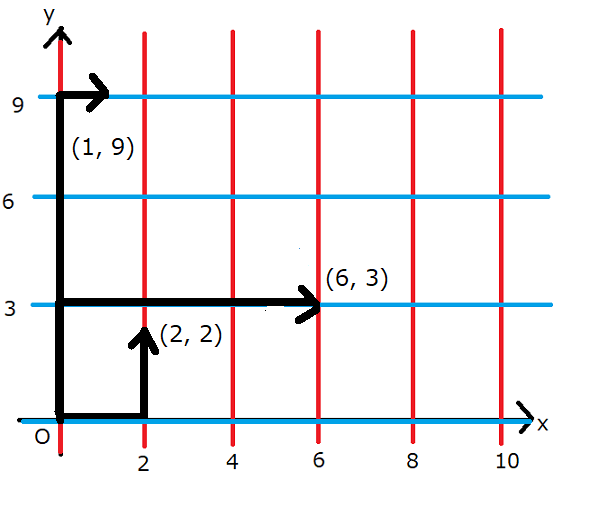

# No.1899 L1 Cafe

## 제한

- 시간 제한: 2초
- 메모리 제한: 512MB

## 문제

앨리스는 무한히 넓은 2차원 평면 위 마을에 살고 있습니다. 앨리스의 집은 원점, 즉 좌표 $(x, y) = (0, 0)$에 있습니다.

이 마을에는, 임의의 음이 아닌 정수 $n$에 대해 직선 $x=An$, 임의의 음이 아닌 정수 $m$에 대해 직선 $y=Bm$으로 표시되는 도로가 있습니다. 이 이외의 도로는 없습니다.

앨리스는 이 마을에서 하나의 정점 $(x, y)$를 골라서 카페를 열려 합니다. 카페를 여는 장소의 후보지 $(x, y)$는 다음 조건을 만족해야합니다.

- $x$와 $y$는 **양의 정수**이다.
- 집 $(0, 0)$에서 맨하탄 거리가 $N$이하이다. 즉, $x+y \le N$이다.
- 집 $(0, 0)$에서 도로만 이용해서 $(x, y)$에 갈 수 있다.

카페를 열 후보지 $(x, y)$로 고려해야 하는 점은 몇 개입니까?

$T$개의 테스트케이스가 주어지므로, 각각에 대해 답해주세요.

## 제한

- 모든 입력은 정수다.
- $1 \le T \le 10^5$
- $2 \le N \le 10^9$
- $1 \le A \le 10^9$
- $1 \le B \le 10^9$

## 입력

입력은 표준 입력에서 주어집니다. 첫 줄에는 다음 형식으로 주어집니다.

|$T$|
|:-|

이후, $T$개의 테스트케이스가 각각 다음 형식으로 주어집니다.
|$N$  $A$  $B$|
|:-|


## 출력


$T$개의 줄을 출력하세요. $i (1 \le i \le T)$번째 줄에는, $i$번 테스트 케이스의 정답을 출력하세요. 

이 문제의 제한에서는, 답이 $2^{63}$을 넘지 않는 것을 증명할 수 있습니다.

마지막에 개행문자를 출력해주세요.

## 예제

### 예제 1

입력

```
5
10 2 3
8 9 10
1200 1 2
31415 92 65
123456789 12345 67890
```

출력

```
27
0
719400
12841651
729437374182
```

$5$개의 테스트케이스가 주어집니다.
첫번째 테스트케이스에 대해, 아래 그림과 같이 직선 $x=0, x=2, x=4, x=6, \dots$와 $y=0, y=3, y=6, y=9 \dots$로 표시된 도로가 있습니다.



예를 들어, $(2, 2)$, $(6, 3)$, $(1, 9)$는 집으로부터 맨하탄 거리가 $10$ 이하이고 위 그림과 같이 도로를 통해 이동하는 것이 가능하므로, 카페를 열 수 있습니다. 조건을 만족하는 좌표는 다른 곳도 있어서, 후보지는 전부 $27$개입니다.

두번째 테스트케이스에서는, 카페를 열 수 있는 위치가 없으므로, $0$을 출력해주세요. 카페를 여는 좌표 $x, y$가 모두 양수여야 하는 것에 주의하세요.

답이 32비트 정수에 들어가지 않을 수 있습니다. 주의해주세요.